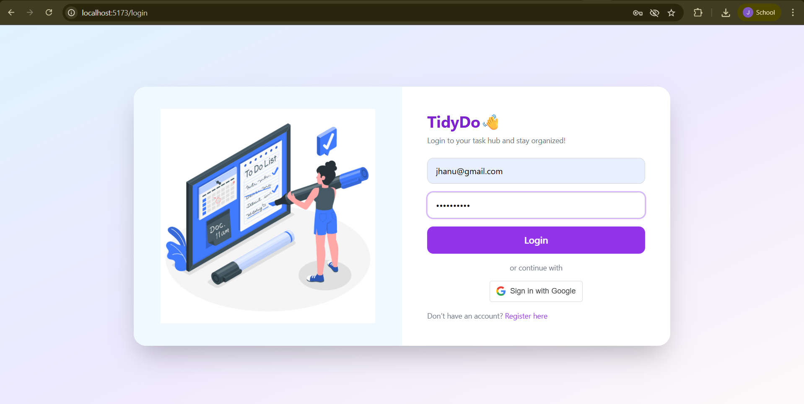
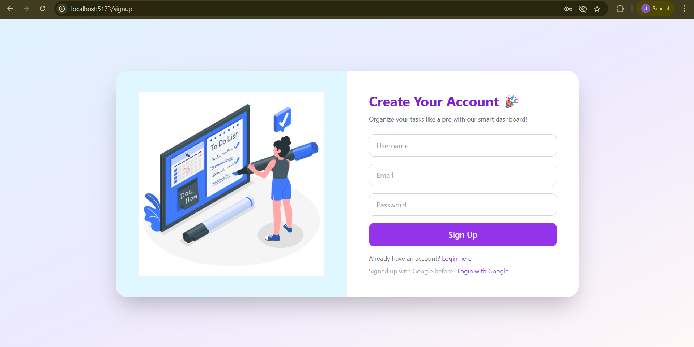
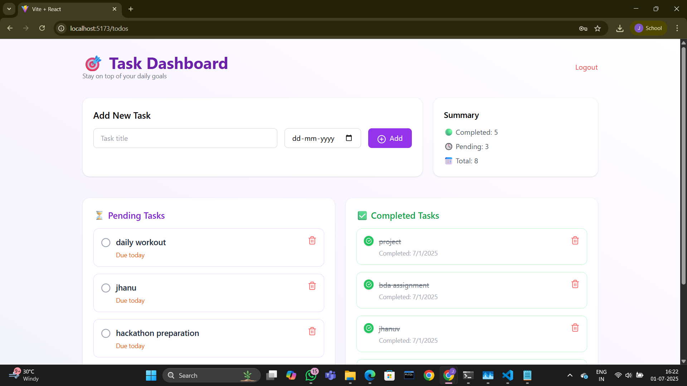

# Katomaran Todo App

A Fullstack Todo Task Management Web Application built as part of the Katomaran Hackathon.

---

## 🚀 Features

- Google OAuth 2.0 Login
- Full CRUD for Tasks (Create, Read, Update, Delete)
- Task Sharing with other users by email or username
- Real-time task updates using Socket.io (WebSockets)
- Responsive UI for Desktop and Mobile
- Filtering tasks by status, due date, or priority
- Toast notifications for actions (create/update/delete)
- Error boundaries and basic offline support

---

## 🛠️ Tech Stack

- **Frontend**: React, Tailwind CSS
- **Backend**: Node.js, Express
- **Authentication**: Google OAuth 2.0, JWT
- **Database**: MongoDB Atlas (Cloud Hosted)
- **Real-time**: WebSocket (Socket.io)
- **Deployment**: 
  - Frontend: [Vercel](https://katomaran-todo-app-alpha.vercel.app)
  - Backend: [Render](https://katomaran-todo-app-3.onrender.com)

---

## 🧑‍💻 Getting Started (Local Setup)

### 🔁 Clone the Repository

```bash
git clone https://github.com/Jhanuvarshini/katomaran-todo-app.git
cd katomaran-todo-app
````

---

### ⚙️ Backend Setup

```bash
cd backend
npm install
# Create a .env file and add:
# MONGO_URI=your_mongodb_connection_string
# GOOGLE_CLIENT_ID=your_google_client_id
# GOOGLE_CLIENT_SECRET=your_google_client_secret
# JWT_SECRET=your_jwt_secret
npm run dev
```

---

### 💻 Frontend Setup

```bash
cd frontend
npm install
npm run dev
```

---

## 🧩 Architecture Diagram

Here’s a clear overview of the app structure:


---

## 🖼️ Screenshots

### 🔐 Login Page



---

### 📝 Signup Page



---

### 🌐 Social Login


---

### ✅ Dashboard



---

### 🚀 Frontend Deployment Status


---

### ⚙️ Backend Deployment Status


---

## 📹 Loom Video Demo

🎥 [**Click to Watch Demo Video on Loom**](https://www.loom.com/share/768ad9ba7eb74c50b552c68bfe6d3862)


---

## 🤝 Assumptions

* Only Google login is implemented for simplicity.
* Task sharing assumes the recipient already exists in the system.
* UI is tested on modern browsers.
* Basic error handling is used to meet hackathon deadlines.

---

## ✅ Submission Requirement

This project is a part of a hackathon run by [https://www.katomaran.com](https://www.katomaran.com)

```

